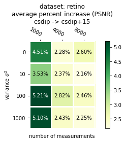
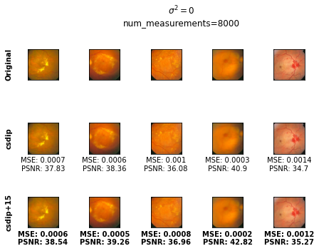
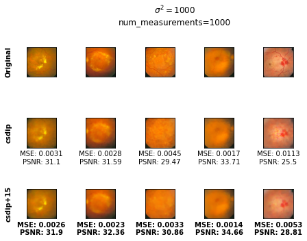
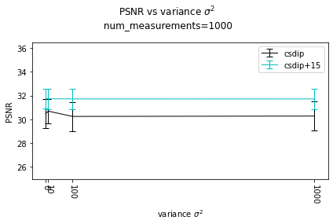
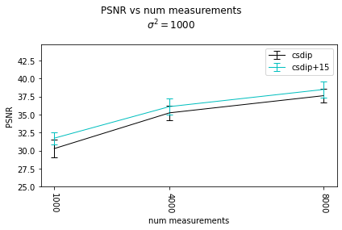

# Deep Image Prior for Compressive Sensing with Low Shot Learning and Learned Regularization

**Reagan Kan  
Georgia Tech  
Spring 2022 CSE 8803-IDM Final Project**  

This repository (forked from [Compressed Sensing with Deep Image Prior](https://github.com/davevanveen/compsensing_dip)) provides code for the final project for the Spring 2022 course [CSE 8803-IDM Imaging with data-driven models](https://flexie.github.io/CSE-8803/) at Georgia Tech.

The proposed methodology (**`csdip+{num_shots}`**) is a hybrid of the learned regularization from [**Compressed Sensing with Deep Image Prior and Learned Regularization**](https://arxiv.org/pdf/1806.06438.pdf) (**`csdip`**) and low shot pre-training from [**Low Shot Learning with Untrained Neural Networks for Imaging Inverse Problems**](https://arxiv.org/pdf/1910.10797.pdf).

More details on the proposed methodology and experiment conclusions can be found in the following:
- [Project Proposal](https://docs.google.com/document/d/1gct7M7HHML8W3GIbRsC2FNo0RVHoUHDUl29gsbPmSGs/edit?usp=sharing)
    - (update): Algorithm 1 is not implemented. Instead, pre-existing learned regularization parameters are used in experiments.
- [Project Presentation](https://docs.google.com/presentation/d/1c1cweUurac37nu8uc4AZj3bMZYWgy6U41p2nVMTA7W0/edit?usp=sharing)
- [Project Report]() 


Here are the results of comparing (**`csdip`**) and (**`csdip+{num_shots}`**) on the STARE retinopathy dataset:

<center></center>

Least noisy & compressed                 | Most noisy & compressed
-----------------------------------------|-----------------------------------------
 | 

PSNR vs noise variance                 | PSNR vs number of measurements
-----------------------------------------|-----------------------------------------
 | 

---

## Compressed Sensing with Deep Image Prior

This repository provides code to reproduce results from the paper: [Compressed Sensing with Deep Image Prior and Learned Regularization](https://arxiv.org/pdf/1806.06438.pdf). 

Here are a few example results:

MNIST at 75 measurements                 | X-ray at 2000 measurements
-----------------------------------------|-----------------------------------------
 | 
      

### Preliminaries
---

1. Clone the repository
    ```shell
    $ git clone https://github.com/reagankan/compsensing_dip.git
    $ cd compsensing_dip
    $ git pull origin python3
    ```
    Please run all commands from the root directory of the repository, i.e from ```compsensing_dip/```

2. Install requirements
    ```shell
    $ conda create -n <env name> python=3.9.11
    $ conda activate <env name>
    $ conda install --file requirements3.txt
    ```


### Plotting reconstructions with existing data
---
1. Open jupyter notebook of plots
    ```shell
    $ jupyter notebook plot.ipynb
    ```	
2. Set variables in the second cell according to interest, e.g. ```DATASET```, ```NUM_MEASUREMENTS_LIST```, ```ALG_LIST```. Existing supported data is described in the comments.

3. Execute cells to view output.


### Generating new reconstructions on the MNIST, xray, or retinopathy datasets
---
1. Execute the baseline command
	```shell
	$ python comp_sensing.py
	```
	which will run experiments with the default parameters specified in ```configs.json```

2. To generate reconstruction data according to user-specified parameters, add command line arguments according to those available in ```parser.py```. Example:
	```shell
	$ python comp_sensing.py --DATASET xray --NUM_MEASUREMENTS 2000 4000 8000 --ALG csdip dct
	```

### Running CS-DIP on a new dataset
---
1. Create a new directory ```/data/dataset_name/sub/``` which contains your images
2. In ```utils.py```, create a new DCGAN architecture. This will be similar to the pre-defined architectures, e.g. ```DCGAN_XRAY```, but must have output dimension equal to the size of your new images. Output dimension can be changed by adjusting kernel_size, stride, and padding as discussed in the [torch.nn documentation](https://pytorch.org/docs/stable/nn.html#convtranspose2d). 
3. Update ```configs.json``` to set parameters for your dataset. Update ```utils.init_dcgan``` to import/initiate the corresponding DCGAN.
4. Generate and plot reconstructions according to instructions above.

Note: We recommend experimenting with the DCGAN architecture and dataset parameters to obtain the best possible reconstructions.


### Generating learned regularization parameters for a new dataset
---
The purpose of this section is to generate a new (\mu, \Sigma) based on layer-wise weights of the DCGAN. This functionality will be added soon.


